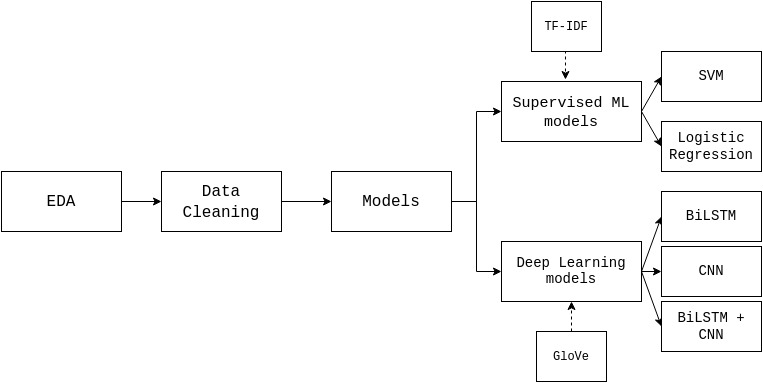

# NLP course project. Disaster tweets: Real or not? 

Our project is dedicated to the development of a model that efficiently classify tweets in terms of whether or not they are about real disasters. The main point is that Twitter is one of the most popular platforms people using to post updates during emergencies, however often “disaster words” can be used metaphorically, as a figure of speech or in a different context, for instance, “Bed time. Don't wake me up unless revolution or Armageddon start.”.

The data from the ongoing Kaggle competition is used in the project:
https://www.kaggle.com/c/nlp-getting-started/data. 
The data consists of:
- id - a unique identifier for each tweet
- text - the text of the tweet
- location - the location the tweet was sent from (may be blank)
- keyword - a particular keyword from the tweet (may be blank)
- target - this denotes whether a tweet is about a real disaster (1) or not (0)
There are 7503 unique instances in the training dataset: 3271 tweets about a real disaster and 4342 tweets that are not about a real disaster.

The results are evaluated using the provided test dataset, which contains 3243 unique values, with accuracy, precision, recall and f1 score metrics.

In this project, we developed a system that identifies tweets about the real disaster, where we implemented, trained and compared the performance of 5 different models: SVM, LR, BiLSTM, CNN,  combined BiLSTM and CNN.

